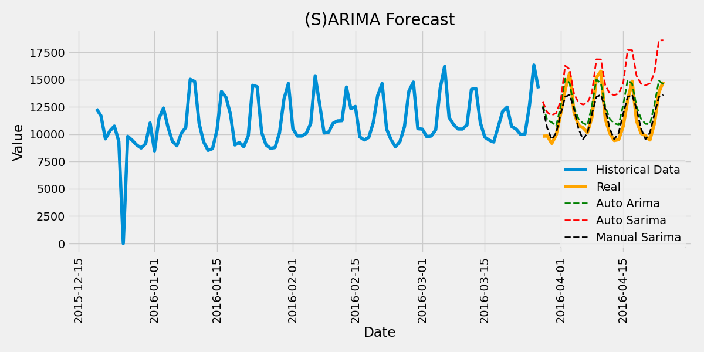
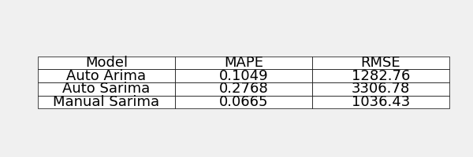

## 📘 Notebooks Objective

This repo serves as a **sandbox for experimentation and exploration** of various **time series forecasting techniques**, using the rich and complex dataset from the **Kaggle M5 Forecasting - Accuracy** competition.

The goal is to apply, analyze, and compare different forecasting models—from classical statistical approaches like **ARIMA**, to more advanced machine learning-based methods—in order to better understand sales dynamics and accurately predict future demand.

This notebook is designed to support flexible experimentation at multiple aggregation levels (e.g., by store, by department, or overall), enabling tests of different model configurations, forecasting horizons, and evaluation metrics.

Ultimately, this repo is envisioned as a **dynamic canvas**, where each code block contributes to building a deeper, more practical understanding of how to tackle real-world forecasting challenges using the M5 dataset as a reference point.\

### First step was ARIMA forecast, seen in [this notebook](M5Forecasting.ipynb).

We use auto Arima to get a baseline forecast. Then Analized de data to see if we can improve the forecast changing the parameters of the model.

Then we outperform autoarima by ~ 3% on a few steps: 

